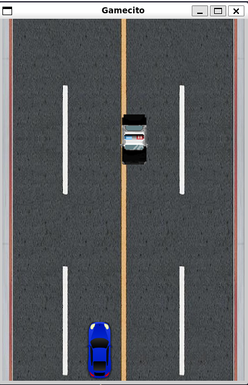

# Infinite Car Game

## Description

An infinite car game where you have to avoid colliding with the oncoming cars. As the game progresses, the speed increases, challenging your ability to move quickly and avoid crashes. Use the arrow keys to control your car and navigate through the traffic.



## Installation

1. Make sure you have Python 3 installed on your system.
2. Clone this repository or download the source code files.
3. Open a terminal/command prompt and navigate to the project directory.
4. Install the required dependencies by running the following command:

```
pip3 install -r requirements.txt
```

## How to Play

1. Open a terminal/command prompt and navigate to the project directory.
2. Run the game by executing the following command:

```
python3 main.py
```

3. Use the following controls to play the game:

- Up Arrow: Move the car upward.
- Down Arrow: Move the car downward.
- Left Arrow: Move the car to the left.
- Right Arrow: Move the car to the right.

4. Avoid collisions with oncoming cars for as long as possible.
5. The speed of the game and the difficulty will gradually increase as you progress.
6. If your car collides with any other car, the game is over.

Have fun playing!

## Credits

This game was developed using the Pygame library. Special thanks to the Pygame community for their contributions and support.

## License

This project is licened under the [MIT License](LICENSE).
Created by Nega García.
Inspired by CodersLegacy.com and Programacionfacil.org
